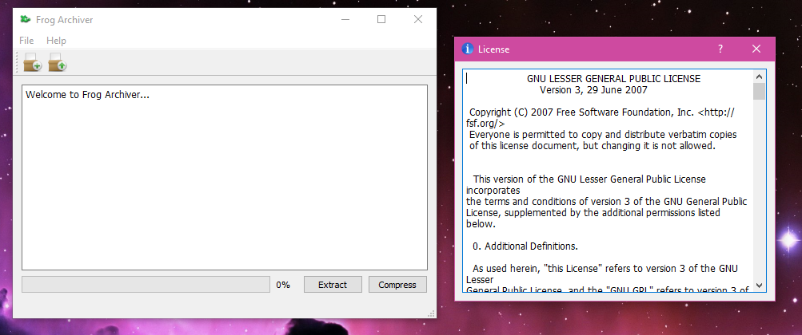

# Frog-Archiver

Frog Archiver is compression tools for any files you have.

## Frog Archiver v.1.0

### Watch Demo Here

Link : [https://youtu.be/THsPWMalRmM](https://youtu.be/THsPWMalRmM)

### Screenshot

#### Linux

#### Windows

### How to Run?

Download in Release Page.

### How to Build?

1. Make sure you have Qt Creator
2. Open FrogArchiver.pro with Qt Creator (You can found in [src](/src/)).
3. Build
4. To run it with double click, you must complete the binary version with qt library.

Alternative

3. Run

### Created by :

* Adam Rotal Yuliandaru
* Ade Surya Ramadhani
* Bervianto Leo Pratama

---

Some source code modified from this source code : [Link](http://code.activestate.com/recipes/577480-huffman-data-compression/)
